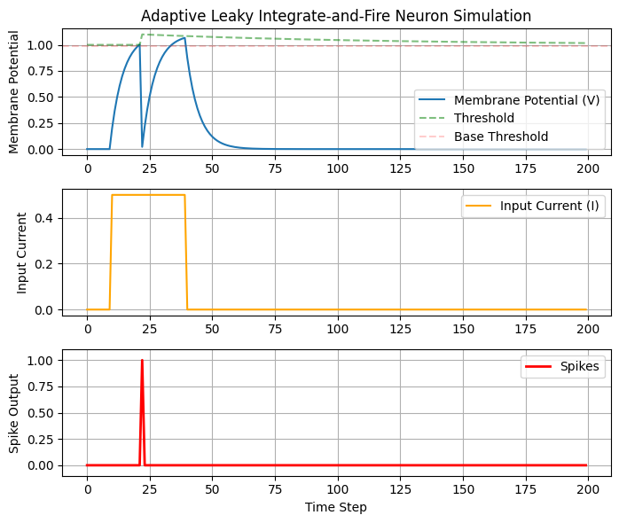
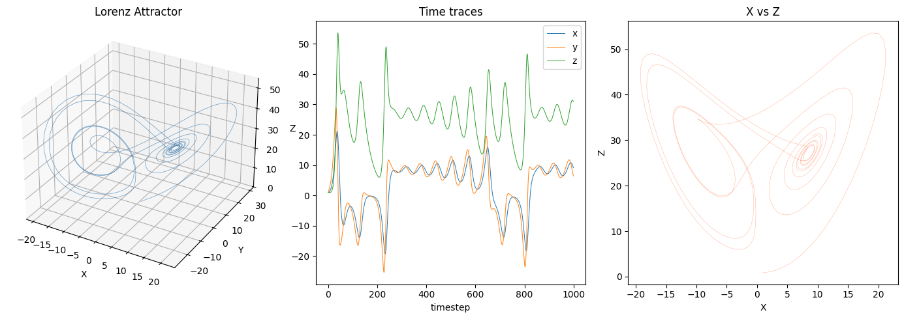
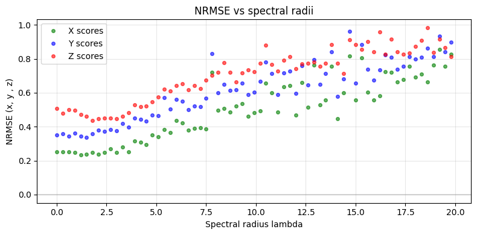
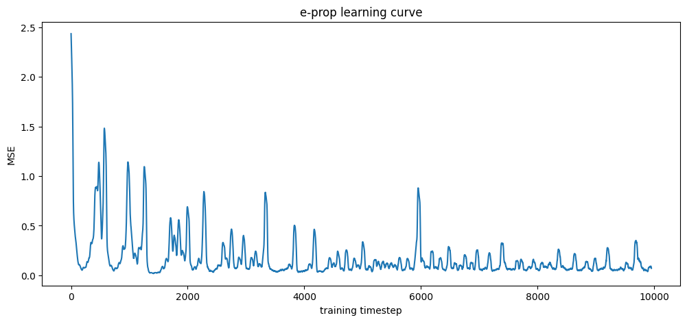

# NeuroSandbox

A from-scratch exploration of spiking neural networks, reservoir computing, and bio-plausible learning rules. The project is built with neuromorphic hardware constraints in mind: the learning rules explored here are online and local, motivated by the fact that backpropagation through time is unavailable on physical neuromorphic substrates. The shift from offline readout training to online eligibility-trace-based learning reflects this constraint directly, and serves as an entry point into understanding the broader training challenges of hardware-deployed spiking networks. All implementations are built from scratch in NumPy, deliberately avoiding autograd or high-level SNN libraries where possible.

All neuron definitions, reservoir definitions, and learning rules include formal equations and parameter descriptions in their respective notebooks.

---

## Notebooks

- [1. Neurons](./notebooks/1._neurons.ipynb) - Defines and simulates the core neuron models: LIF and ALIF. Includes formal equations, parameter descriptions, and visualizations of neuron dynamics under input, including membrane potential evolution, spiking behavior, and threshold adaptation.

- [2. Reservoir](./notebooks/2._reservoir.ipynb) - Defines the reservoir architecture: a fixed randomly connected recurrent network of LIF neurons. Covers weight matrix initialization, spectral radius scaling, and recurrent LIF dynamics [1,2].

- [3. Lorenz](./notebooks/3._lorenz.ipynb) - Uses the reservoir to predict the Lorenz attractor trajectory. Covers trajectory generation, input encoding, reservoir state collection, and offline readout training via ridge regression and least squares. Includes NRMSE evaluation and trajectory visualization.

- [4. Lorenz Spectral Radius Sweep](./notebooks/4._lorenz_spectral.ipynb) - Trains and evaluates the reservoir across a range of spectral radii. Visualizes how prediction error varies with spectral radius and discusses the results.

- [5. Lorenz R-STDP (Presynaptic Variant)](./notebooks/5._lorenz_RSTDP.ipynb) - Replaces offline readout training with an online, bio-plausible learning rule based on Reward-Modulated STDP (R-STDP) [3]. Only the readout weights are updated; the reservoir remains fixed. Uses a presynaptic-only eligibility trace. Includes a training loss curve and NRMSE evaluation.

---

## Progress

### ALIF Neuron Dynamics

The plot below shows an ALIF neuron integrating a noisy input signal over time. The membrane potential accumulates input, leaks between spikes, and resets on each spike. The adaptive threshold increases on each spike and decays back toward baseline between spikes, producing spike-frequency adaptation.

---

### Lorenz Attractor

The reservoir is driven by the Lorenz system, a three-dimensional chaotic dynamical system commonly used as a benchmark for reservoir computing. The plot below shows the characteristic butterfly-shaped attractor.

---

### Spectral Radius Sweep

The plot below shows NRMSE across the three Lorenz dimensions as a function of spectral radius.

Reservoir computing literature generally associates spectral radii below 1 with better performance, as this keeps the reservoir in a stable regime with controlled memory. The results here do not clearly follow this pattern, which is likely attributable to several factors:

- **LIF dynamics.** The theoretical guarantees around spectral radius are derived primarily for rate-based reservoir models (Echo State Networks). In a spiking LIF reservoir, the membrane decay parameter $\beta$ introduces an additional timescale that interacts with the spectral radius in non-trivial ways, making the relationship between spectral radius and performance less straightforward.
- **Hyperparameter sensitivity.** The optimal spectral radius is not independent of the other hyperparameters. $\beta$, $W_{in}$ scaling, neuron density, and connectivity jointly determine the effective operating regime of the reservoir, and without tuning these together, the spectral radius sweep reflects the combined effect of all of them.

note: The input weights $W_{in}$ and the spectral radius effectively compete in determining the dominant source of drive in the reservoir. When $W_{in}$ is large relative to the recurrent dynamics, the spectral radius has a reduced and less predictable effect on performance.

---

### Online Learning Curve (R-STDP)

The plot below shows the training loss curve for the online R-STDP learning rule.

The loss oscillates but trends downward over training, which is expected given
the chaotic nature of the target signal and the noisy, binary spike activity used in place of exact gradients. The error stabilizes around 0.2 after sufficient training steps, consistent with the NRMSE scores reported in the comparison table below.

A full R-STDP formulation would additionally include a postsynaptic factor in the eligibility trace, conditioning each synaptic update on the co-activity of both the presynaptic reservoir neuron and the postsynaptic readout unit [1]. This extension was attempted but produced unstable training dynamics on this task, likely due to unbounded growth in the trace when the continuous-valued readout output enters the Hebbian product. The presynaptic-only variant is therefore retained as the working implementation.

---

## Methods Comparison

| Method | Online | Bio-plausible | NRMSE (x / y / z) |
|---|---|---|---|
| Ridge Regression | No | No | **0.252** / **0.362** / **0.460** |
| Simplified e-prop | Yes | Partially | 0.453 / 0.471 / 0.462 |

Ridge regression achieves lower error overall. The simplified e-prop rule trades some prediction accuracy for an online, incrementally updated process that does not require storing the full spike record, which is the relevant constraint for neuromorphic deployment.

## Goals and Future development

I plan on:

- Implement more online, bio-plausible methods, and compare them with existing results (like FORCE).
- Compare ALIF vs LIF performance.
- Perform more experiments on error vs SR, and determine the ideal parameters and conditions (while finding proper justifications for why they allow the network to behave as such)

---

## Notes

- This is an ongoing project, built incrementally as concepts are studied and implemented.
- Neuron equations, reservoir formulation, and learning rules are formally defined with equations in their respective notebooks.
- The e-prop implementation is a simplified variant. A full e-prop implementation would additionally propagate learning signals through the recurrent weights using approximated gradients, which is not done here.

## References

[1] Jaeger, Herbert. (2001). The" echo state" approach to analysing and training recurrent neural networks-with an erratum note'. Bonn, Germany: German National Research Center for Information Technology GMD Technical Report. 148. 

[2] Lukoševičius, M. (2012). A practical guide to applying echo state networks. In Neural Networks: Tricks of the Trade: Second Edition (pp. 659-686). Berlin, Heidelberg: Springer Berlin Heidelberg.

[3] Legenstein, R., Pecevski, D., & Maass, W. (2008). A learning theory for reward-modulated spike-timing-dependent plasticity with application to biofeedback. *PLOS Computational Biology*, 4(10), e1000180.
